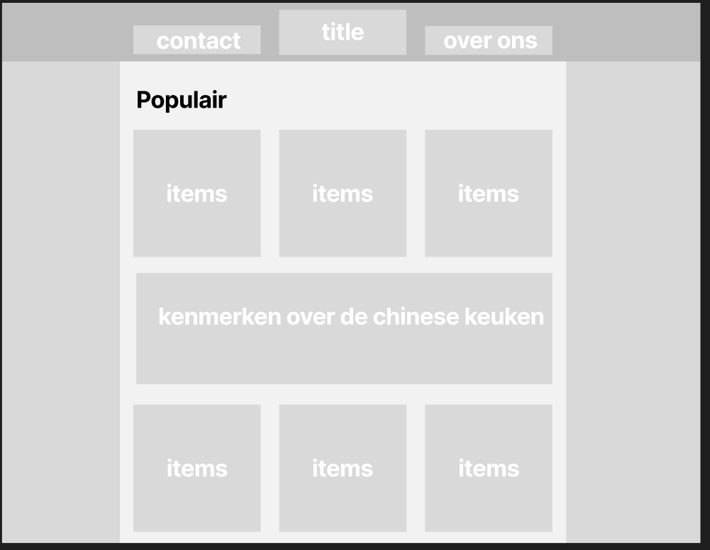
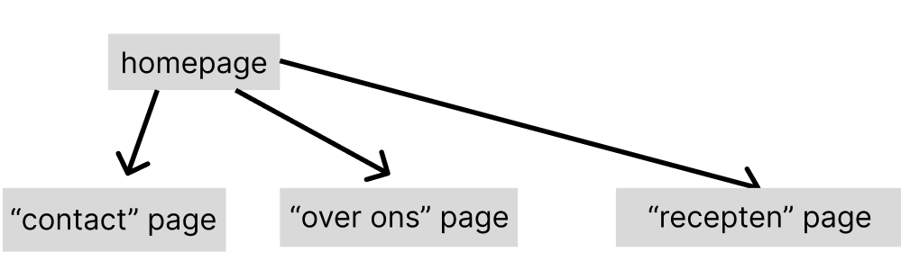

## idee van de website

### Het onderwerp

het onderwerp van de website is voor recepten uit de chinese keuken 

### Doelgroep

De doelgroep kan verschillen van leeftijd het kunnen mensen zo jong als 16 zijn maar ook zo oud als 80 als ze maar iets zoeken hebben met de chinese keuken
het doel van de website is om mensen naar 

### Hoe ga ik de functionele eisen verwerken

- de feed gaat uit bepaalde recepten bestaan

- onderaan komt er een contacten formulier te staan

- voor een custom post type ga ik revieuws toevoegen in de website

- en voor de stijl ga ik in de stijl van de google websites zoals google docs of photos

### Wireframe

### Flow Chart

